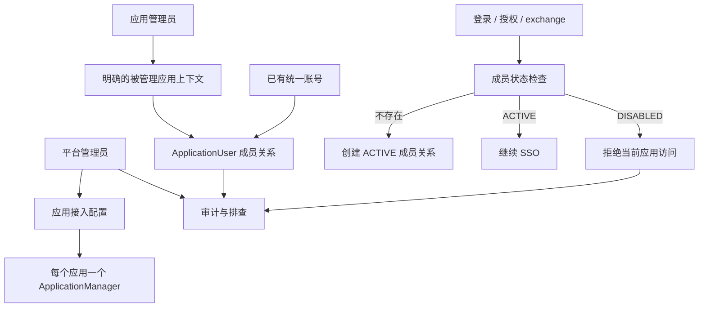

# 应用管理员边界实现计划

## 摘要

本计划围绕已经修订过的后台管理边界，调整当前应用用户管理实现。平台管理员负责统一账号基础设施和应用接入配置，应用管理员负责自己被指派应用内的成员关系。应用用户管理必须在 UI 和 API 两层都绑定到应用管理员上下文，不能只靠隐藏侧边栏入口来表达权限边界。

---

## 问题背景

当前实现已经引入 `ApplicationManager` 和 `ApplicationUser`，但共享的权限辅助函数仍然把平台管理员权限视为足以查看和修改应用用户。当前应用用户页面也允许应用管理员从这个表面创建全局账号。这两个行为都会模糊已经确认的产品边界：这个服务是自有产品生态的统一账号和 SSO 中心，每个接入应用应有清晰指派的管理员，并且该管理员只管理本应用的成员关系。

---

## 需求

**平台边界**

- R1. 平台管理员可以创建、编辑、禁用和排查接入应用，但默认平台导航中不展示应用用户管理入口。覆盖来源 R1、R2、R5。
- R2. 平台管理员不能仅凭平台角色访问应用用户管理页面或 API；成员管理必须具备对应应用的应用管理员上下文。覆盖来源 R6、AE2。
- R3. 平台管理员排查接入问题时使用应用配置、账号状态和审计日志，不直接承担日常应用成员运营。覆盖来源 R5 和范围边界。

**应用管理员指派**

- R4. 创建或启用一个可接入应用时，必须从已有且可用的统一账号中选择至少一个管理员账号。覆盖来源 R3、AE8。
- R5. 编辑应用时可以更换指派管理员；管理员指派、更换、冻结能力都必须进入审计。覆盖来源 R4、R18。
- R6. 数据模型继续使用 `ApplicationManager` 关系表，API 和 UI 合同暴露“每个应用一个或多个管理员账号”。覆盖来源关键决策和范围边界。

**应用成员管理**

- R7. 应用管理员只能查看、关联、启用和禁用自己负责应用下的成员。覆盖来源 R7-R11。
- R8. 关联应用成员表示选择一个已有统一账号；应用管理员不能在该表面创建全局账号。覆盖来源 R10、AE6。
- R9. 如果同一个账号负责多个应用，所有成员列表和变更操作都必须绑定到明确选择的应用。覆盖来源 R9、AE4。
- R10. 如果同一账号既是平台管理员又是应用管理员，默认后台仍进入平台视角；成员管理必须通过明确的应用管理员入口或应用上下文进入。覆盖来源 R12、AE11。

**SSO 成员状态**

- R11. 用户首次通过某个接入应用登录或授权时，如果不存在成员关系，则创建 `ACTIVE` 成员关系。覆盖来源 R15、AE9。
- R12. `DISABLED` 应用成员关系会阻止该应用的登录或授权，并且不会被 SSO 流程自动重新启用。覆盖来源 R16、AE10。
- R13. 重复登录或授权只更新登录元数据，不创建重复成员关系，也不绕过禁用状态。覆盖来源 R17。

**审计与反馈**

- R14. 审计日志覆盖应用创建、编辑、禁用、管理员指派变更、成员关联、启用、禁用、跨应用越权拒绝、密钥变更和回调地址变更。覆盖来源 R18-R19。
- R15. 应用用户管理界面需要覆盖空列表、重复关联、成功、失败、无权限、当前管理员无可管理应用等状态。覆盖来源 R20。

---

## 关键技术决策

- KTD1. 将平台配置授权和应用成员授权拆开。`isAdmin` 仍用于平台配置端点；新的或重命名后的成员授权辅助函数，例如 `canManageApplicationMembers`，必须检查目标应用下的 `ApplicationManager` 记录。当前 `canManageApplication` 对平台管理员直接返回 true 的行为不能继续用于应用用户端点。
- KTD2. 继续使用 `ApplicationManager` 作为持久化模型，并在应用 API 和 UI 层支持多个管理员；应用启用前至少需要一个可用管理员。
- KTD3. 将 `ApplicationUser` 定义为已有统一账号和应用之间的成员关系。应用用户 API 应只接收 `userId` 进行关联，并移除当前应用管理员用 username/password 创建 `User` 记录的路径。
- KTD4. 成员管理必须显式绑定应用上下文。只有应用管理员身份的账号可以直接进入应用用户表面；同时拥有平台管理员角色的账号默认进入平台视角，并通过指定的被管理应用上下文进入成员管理。
- KTD5. 应用级禁用状态必须保持为硬访问限制。SSO 辅助函数可以自动创建缺失的成员关系，但遇到已禁用成员关系时必须返回拒绝结果，不能静默重新启用。
- KTD6. 越权拒绝也要作为边界证据进入审计。成员路由上的授权失败应记录操作者、目标应用、目标用户、动作、结果和失败原因；目标信息未知时记录已知部分。

---

## 高层技术设计

这次调整不引入新的复杂 IAM。核心是收窄两个已有概念的合同：平台角色负责身份基础设施，`ApplicationManager` 授予某个接入应用的一次性成员管理权。

---

## 实施单元

### U1. 授权辅助函数与后台上下文

- **目标:** 拆分平台管理员访问权限和应用成员管理权限。
- **文件:** `src/lib/application-access.ts`, `src/lib/permissions.ts`, `src/app/api/auth/me/route.ts`, `src/app/api/auth/login/route.ts`, `src/app/admin/login/page.tsx`.
- **做法:** 保留 `getUserAdminContext` 返回 `isAdmin`、`managedApplications` 和 `canAccessAdmin`。新增一个只检查有效应用管理员指派关系的成员授权辅助函数。应用用户端点改用该辅助函数，避免平台管理员仅凭平台角色通过。
- **测试场景:** `src/lib/application-access.test.ts` 应覆盖未被指派的平台管理员不能管理成员、被指派的应用管理员可以管理、未被指派的应用管理员被拒绝、禁用应用被拒绝、平台角色和应用管理员角色重叠时仍需具备目标应用指派关系。
- **验证:** 如果引入测试框架，则补充测试命令；否则用手动 API 请求验证 200/403 场景，然后运行 `npx tsc --noEmit`、`npm run lint`、`npm run build`。

### U2. 必填的应用管理员配置

- **目标:** 将一个已有且可用的统一账号作为活跃应用配置的必填项。
- **文件:** `src/lib/validations.ts`, `src/app/api/applications/route.ts`, `src/app/api/applications/[id]/route.ts`, `src/app/api/applications/[id]/managers/route.ts`, `src/app/admin/(dashboard)/applications/page.tsx`.
- **做法:** 在创建和更新应用流程中加入 `adminUserIds` 合同。校验所有目标用户存在且状态可用。在创建或更新事务中，将该应用现有管理员记录同步为所选管理员集合。应用列表和详情响应返回已指派管理员数组，供 UI 展示和编辑。
- **测试场景:** `src/app/api/applications/route.test.ts` 应覆盖未选择管理员时创建被拒绝、选择禁用或不存在管理员时被拒绝、选择有效管理员时创建一条管理员记录、编辑时替换管理员、保存其他配置时保留当前管理员。
- **验证:** 确认应用弹窗在缺少有效管理员时不能保存活跃应用，并确认 `ASSIGN_APPLICATION_MANAGER` 或等价审计记录被写入。

### U3. 应用成员 API 语义

- **目标:** 将应用用户 API 从创建全局账号改为关联已有账号的应用成员关系。
- **文件:** `src/app/api/application-users/route.ts`, `src/app/api/application-users/[id]/route.ts`, `src/app/api/application-users/eligible-users/route.ts`, `src/lib/application-access.ts`, `src/lib/validations.ts`.
- **做法:** 让 `POST /api/application-users` 只接收 `appId` 和 `userId`。新增受限的已有账号搜索端点，供应用管理员选择活跃账号；该端点只返回最少字段，并要求搜索词或分页上限。对重复关联返回清晰的重复状态；遇到已禁用成员关系时要求显式启用，不能在关联时静默恢复。
- **测试场景:** `src/app/api/application-users/route.test.ts` 应覆盖应用管理员只看到被指派应用、访问其他应用被拒绝、平台管理员仅凭平台角色被拒绝、关联已有用户成功、重复活跃成员返回重复反馈、重复禁用成员不自动重新启用、越权拒绝写审计。
- **验证:** 在路由测试建立前，分别用应用管理员、平台管理员、角色重叠账号和无关账号 token 手动验证 GET/POST/PUT/DELETE。

### U4. 应用用户管理 UI 上下文

- **目标:** 让应用用户页面符合受限成员管理模型。
- **文件:** `src/app/admin/(dashboard)/application-users/page.tsx`, `src/components/admin-sidebar.tsx`, `src/app/admin/(dashboard)/page.tsx`, `src/app/admin/login/page.tsx`.
- **做法:** 从弹窗中移除 username/password 账号创建字段，替换为已有账号搜索和选择流程。只有一个被管理应用的应用管理员默认进入该应用上下文；管理多个应用时需要展示清晰的应用选择器。仅平台管理员账号隐藏页面入口，并在直接访问时展示被拒绝状态。角色重叠账号默认保留平台导航，成员管理通过被管理应用上下文进入。
- **测试场景:** 仅平台管理员账号看不到 `应用用户` 导航项，直接访问页面或 API 时进入拒绝状态；仅应用管理员账号登录后进入成员页；多应用管理员不能在未选择上下文时查看所有应用成员；重复、空列表、无可管理应用、成功、失败和拒绝状态都有清晰反馈。
- **验证:** API 行为就绪后，用浏览器分别检查仅平台管理员、仅应用管理员、多应用管理员和角色重叠账号的本地会话状态。

### U5. SSO 成员状态机

- **目标:** 保持生态应用快速接入，同时尊重应用级禁用状态。
- **文件:** `src/lib/application-access.ts`, `src/app/api/auth/login/route.ts`, `src/app/api/auth/register/route.ts`, `src/app/api/auth/authorize/route.ts`, `src/app/api/auth/exchange/route.ts`.
- **做法:** 使用 `ensureApplicationAccess` 统一处理登录、授权、注册和 exchange。`OPEN` 缺失成员关系时创建 `ACTIVE`；`MEMBERS_ONLY` 缺失成员关系时拒绝；`ADMINS_ONLY` 仅允许应用管理员；已有 `DISABLED` 成员关系在所有模式下拒绝，并在路由具备上下文时写入审计详情。
- **测试场景:** `src/lib/application-access.test.ts` 应覆盖缺失、活跃和禁用成员关系三个分支。`src/app/api/auth/authorize/route.test.ts` 应覆盖禁用成员关系在授权码签发前被拒绝，以及重复授权不会创建重复记录。
- **验证:** 分别用缺失、活跃和禁用成员关系验证携带 `appId` 的登录、注册、授权和 exchange 流程。

### U6. 审计覆盖与恢复行为

- **目标:** 让边界变化可追踪、可恢复。
- **文件:** `src/lib/audit.ts`, `src/app/api/applications/route.ts`, `src/app/api/applications/[id]/route.ts`, `src/app/api/applications/[id]/managers/route.ts`, `src/app/api/application-users/route.ts`, `src/app/api/application-users/[id]/route.ts`, `src/app/admin/(dashboard)/audit-logs/page.tsx`.
- **做法:** 标准化管理员指派、管理员重指派、成员关联、成员启用/禁用和跨边界拒绝的审计 action 与 detail。被指派管理员账号禁用或删除后，成员管理能力应失败关闭，直到平台管理员重新指派。
- **测试场景:** 审计检查应覆盖管理员重指派、成员关联、成员禁用/启用、跨应用请求被拒绝、管理员账号禁用后失去应用管理能力。
- **验证:** 确认审计日志记录操作者、目标应用、目标用户、动作、结果，以及适用场景下的失败原因。

### U7. 文档与接入说明

- **目标:** 让产品文案与统一账号和应用管理员模型一致。
- **文件:** `src/app/admin/(dashboard)/integration-docs/page.tsx`, `README.md`, `docs/brainstorms/2026-06-10-admin-boundary-requirements.md`.
- **做法:** 文档说明接入应用使用统一账号和 SSO，每个活跃应用有一个或多个指派管理员，应用管理员只能把已有账号关联为应用成员，禁用成员关系只影响单个应用，并说明 `OPEN`、`MEMBERS_ONLY`、`ADMINS_ONLY` 三种访问模式。
- **测试场景:** 文档不能暗示应用管理员可以创建全局账号、管理全局角色或修改应用密钥和回调地址。
- **验证:** 检查渲染后的文档文案，并运行 `npm run build`。

---

## 系统影响

- `application-users` 端点的授权语义会变化：平台角色不再自动代表成员管理权限。
- 应用创建会依赖一个已有且可用的用户账号作为管理员指派对象。
- 应用用户创建的语义会从创建账号变成关联成员关系。
- SSO 对首次进入生态应用仍保持低摩擦，但禁用的应用成员关系会在登录、授权和 exchange 路径上成为硬访问限制。
- 审计日志成为产品边界的一部分，而不是附带的运维记录。

---

## 范围边界

- 本计划不引入复杂 IAM、细粒度权限策略、租户、组织或应用内角色。
- 本计划支持单应用多个管理员，但不引入应用内角色、组织或租户模型。
- 本计划不允许应用管理员创建全局账号。
- 本计划不把平台管理员设为默认应用管理员，也不把平台管理员 API 权限等同于应用成员管理权限。
- 本计划不增加平台管理员的破窗式只读成员诊断能力；如果未来需要，应单独设计。

---

## 风险与依赖

- 当前仓库没有配置测试脚本。由于本次工作会改变授权行为，强烈建议补充聚焦的辅助函数和路由测试；如果暂不做测试，手动 token API 验证必须覆盖同等场景。
- 现有未提交工作已经加入了应用用户管理能力。实施时应在现有改动上调整，而不是叠加第二套竞争模型。
- 给应用管理员提供已有账号搜索会暴露账号元数据。该端点应返回最少字段、要求授权，并避免无过滤的大范围用户导出。
- 活跃应用要求管理员账号后，seed 数据、演示数据或已有应用记录可能需要迁移或清理路径，才能严格启用校验。

---

## 验收示例

- AE1. Given 平台管理员登录 `/admin`，When 侧边栏渲染，Then 不展示 `应用用户`。
- AE2. Given 平台管理员没有被指派为目标应用管理员，When 直接请求应用用户 API，Then 系统返回 403 并写入越权拒绝审计事件。
- AE3. Given 平台管理员创建活跃应用但没有选择管理员，When 表单或 API 提交，Then 系统拒绝保存。
- AE4. Given 应用当前管理员为 A，When 平台管理员将管理员改为 B 并保存成功，Then A 失去该应用成员管理权限，B 获得该权限。
- AE5. Given 应用管理员关联用户，When 目标账号已经存在且状态可用，Then 系统为当前应用创建成员关系，而不是创建新的全局账号。
- AE6. Given 应用管理员管理两个应用，When 打开成员管理，Then 每个列表和变更操作都限定在当前选择的应用。
- AE7. Given 用户只在应用 A 中被禁用，When 该用户访问应用 B，Then 应用 B 的访问不受影响。
- AE8. Given 用户在应用 A 中被禁用，When 该用户再次登录或授权应用 A，Then 系统拒绝访问且不重新启用成员关系。
- AE9. Given 同一账号既是平台管理员又是应用管理员，When 登录后台，Then 默认进入平台视角，并且必须显式进入被管理应用上下文才能管理成员。

---

## 来源

- `docs/brainstorms/2026-06-10-admin-boundary-requirements.md`
- `prisma/schema.prisma`
- `src/lib/application-access.ts`
- `src/lib/permissions.ts`
- `src/components/admin-sidebar.tsx`
- `src/app/admin/(dashboard)/applications/page.tsx`
- `src/app/admin/(dashboard)/application-users/page.tsx`
- `src/app/api/application-users/route.ts`
- `src/app/api/application-users/[id]/route.ts`
- `src/app/api/applications/route.ts`
- `src/app/api/applications/[id]/route.ts`
- `src/app/api/applications/[id]/managers/route.ts`
- `src/app/api/auth/login/route.ts`
- `src/app/api/auth/authorize/route.ts`
- `src/app/api/auth/exchange/route.ts`
- `src/app/api/auth/register/route.ts`
